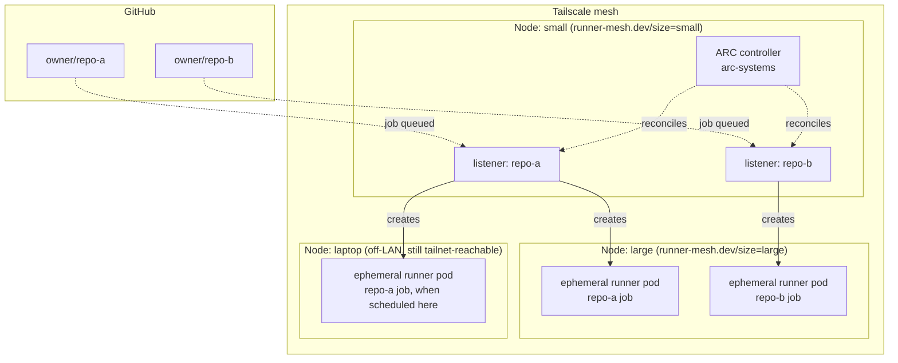
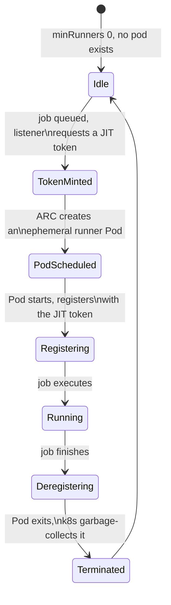

# runner-mesh

Ephemeral, autoscaling GitHub Actions runners on **your own** Kubernetes
cluster — no fixed containers idling 24/7, no per-repo hand registration,
namespace-isolated per repository, authenticated as a scoped GitHub App
instead of a personal access token.

`runner-mesh` is a thin, opinionated CLI over
[`actions/actions-runner-controller`](https://github.com/actions/actions-runner-controller)
(ARC) — GitHub's own Kubernetes controller for self-hosted runners. It
doesn't reimplement runner registration; it makes the parts around ARC
(GitHub App setup, per-repo onboarding, node sizing, cluster health) fast
and safe to operate.

## Topology

One logical cluster, spanning as many nodes as you join to it over
Tailscale (`node:init`/`node:join`/`node:auto`) — **not** multiple
independent clusters; there's no cross-cluster federation here. A small
node can host the control plane and lightweight listener pods while a
big node (or several) takes the actual job workload, and a laptop stays
a valid node even after it leaves your LAN:



The controller and listener pods are cheap and stay put on the small
node; job pods — the only thing that actually needs CPU/memory headroom —
land on `large` via `nodeSelector`, or on whichever node is available if
you haven't tiered your nodes. See
[`docs/architecture.md`](docs/architecture.md) for the namespace-mode and
runner-limit details behind this picture.

### One job's lifecycle



No long-lived registration token, no idle pod between jobs — every state
after `Idle` exists only for the lifetime of one job.

## Why

Running a fixed pair of always-on Docker containers as self-hosted runners
works, but it doesn't scale with job volume, wastes resources at idle, has
no per-repo isolation, and typically relies on a long-lived token. ARC
fixes the underlying mechanics — scale-to-zero, JIT per-job tokens,
Kubernetes-native scheduling — but wiring it up (GitHub App, per-repo
scale-sets, namespaces, node sizing) is enough manual YAML that most
homelab/small-team setups skip it. `runner-mesh` is that wiring, scripted
and idempotent.

## What you get

- **Scale-to-zero**: `minRunners: 0` by default — a runner pod only exists
  while a job is actually queued or running.
- **Configurable namespace layout**: repos share one namespace by default
  (`RM_NAMESPACE_MODE=shared` — fewer objects, since a GitHub App
  installation's credentials are identical across every repo it covers
  anyway), or opt into `per-repo` for namespace-scoped Secret isolation.
  Neither mode enforces network isolation between repos without your own
  `NetworkPolicy` yet — see [`docs/security.md`](docs/security.md) for the
  honest current boundary.
- **GitHub App auth**, not a PAT: scoped, revocable, not tied to your
  personal account. `app:init` automates everything except the one
  GitHub-mandated browser click. See
  [`docs/github-app-setup.md`](docs/github-app-setup.md).
- **Two-layer runner limits**: business-level `maxRunners` per repo, plus
  real pod `resources.requests`/`limits` as the physical ceiling — both
  configurable, neither alone sufficient. See
  [`docs/architecture.md`](docs/architecture.md).
- **Bring-your-own-cluster, or plan a new one**: works against any
  `kubectl` context — colima (`--kubernetes`), k3d, bare-metal k3s,
  anything conformant. For a real multi-machine cluster (including a
  laptop that leaves your LAN), `node:init`/`node:join`/`node:auto` plan a
  Tailscale-meshed k3s bootstrap — same two secrets on every machine for
  `node:auto`. These print the exact commands rather than running
  `curl | sudo sh` on your behalf on principle, not as a missing feature —
  see [`docs/tailscale-mesh.md`](docs/tailscale-mesh.md).

## Quickstart

The fastest path to seeing this work end-to-end is a local disposable
cluster — see [`docs/quickstart-colima.md`](docs/quickstart-colima.md) for
the full walkthrough. Short version:

```bash
colima start --kubernetes
kubectl config use-context colima

./bin/runner-mesh doctor            # verify toolchain + cluster
./bin/runner-mesh cluster:install   # install the ARC controller (once)
./bin/runner-mesh app:init          # create a GitHub App (one browser click)
./bin/runner-mesh repos:list        # see repos the App can access
./bin/runner-mesh repos:add         # interactively pick which get runners
./bin/runner-mesh status            # controller + per-repo health
```

## Prerequisites

- `bash` >= 5
- `kubectl`, pointed at a cluster you control
- `helm` >= 3.14
- `gh` CLI, authenticated
- `jq`, `python3`, `openssl`

`./bin/runner-mesh doctor` checks all of the above and tells you exactly
what's missing.

## Commands

| Command | Does |
|---|---|
| `doctor` | Verify local toolchain and cluster connectivity |
| `node:init` | Print the plan to bootstrap the first Tailscale-meshed k3s node |
| `node:join` | Print the plan to join an existing cluster |
| `node:auto` | Read-only discovery + print init or join plan automatically |
| `cluster:install` | Install/upgrade the ARC controller (cluster-wide, once) |
| `cluster:uninstall` | Remove the controller |
| `app:init` | Create a GitHub App via the manifest flow, store credentials |
| `repos:list` | List repos the App can see and their provisioned state |
| `repos:add [owner/repo ...]` | Provision a runner pool (interactive if no args) |
| `repos:remove <owner/repo>` | Tear down a repo's runner pool |
| `status` | Controller + per-repo runner pool health |

Global flags: `--yes`/`-y` (skip confirmations), `--dry-run`.

## Documentation

- [`docs/architecture.md`](docs/architecture.md) — components, isolation
  model, runner-limit layers, node sizing
- [`docs/github-app-setup.md`](docs/github-app-setup.md) — the manifest
  flow, what's automated vs. the one manual step
- [`docs/quickstart-colima.md`](docs/quickstart-colima.md) — end-to-end
  local walkthrough
- [`docs/tailscale-mesh.md`](docs/tailscale-mesh.md) — joining multiple
  machines (including ones that leave your LAN) into one cluster
- [`docs/security.md`](docs/security.md) — threat model and hardening
  checklist
- [`docs/roadmap.md`](docs/roadmap.md) — what's implemented vs. designed

## Status

Pre-1.0, actively developed. The core loop (controller install, GitHub App
setup, per-repo provisioning, status) is implemented and CI-tested against
a real k3d cluster on every push. `node:*` cluster bootstrap plans a real
Tailscale-meshed k3s cluster but hasn't been exercised against a real
Linux host by the person who wrote it — validate on your own hardware
before depending on it, and see the roadmap for what else is still ahead.

## Contributing

See [`CONTRIBUTING.md`](CONTRIBUTING.md). Small, focused, Conventional
Commits preferred.

## License

[MIT](LICENSE)
