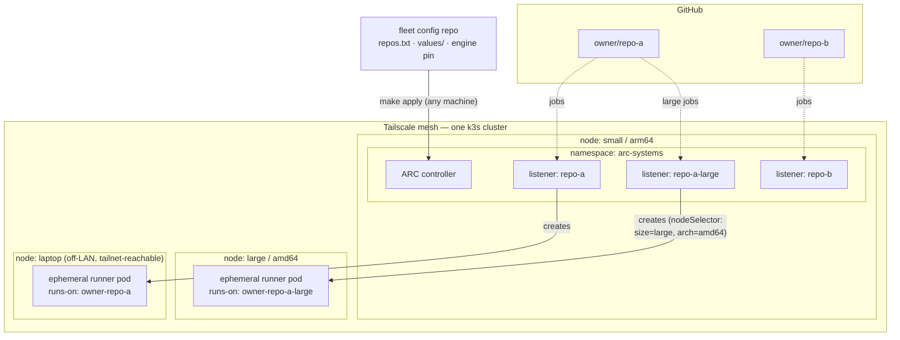
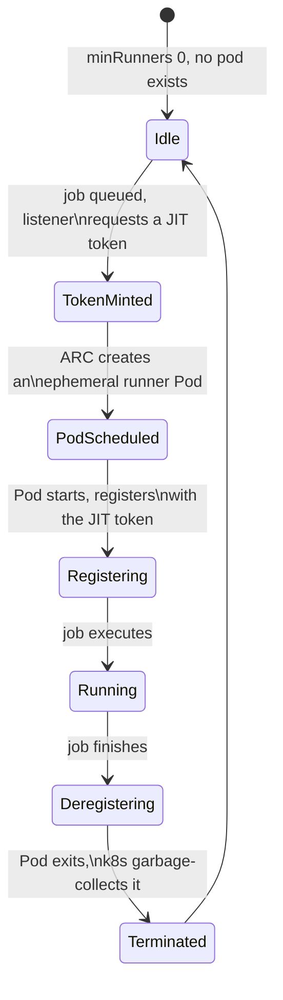

# runner-mesh

[](https://github.com/eilst/runner-mesh/actions/workflows/lint.yml)
[](https://github.com/eilst/runner-mesh/actions/workflows/smoke-test.yml)
[](https://github.com/eilst/runner-mesh/actions/workflows/security.yml)
[](https://scorecard.dev/viewer/?uri=github.com/eilst/runner-mesh)
[](LICENSE)

Ephemeral, autoscaling GitHub Actions runners on **your own** Kubernetes
cluster — no fixed containers idling 24/7, no per-repo hand registration,
scale-to-zero pools per repo (and per size tier), authenticated as a
scoped GitHub App instead of a personal access token, with your whole
fleet declared in one small config repo.

`runner-mesh` is a thin, opinionated CLI over
[`actions/actions-runner-controller`](https://github.com/actions/actions-runner-controller)
(ARC) — GitHub's own Kubernetes controller for self-hosted runners. It
doesn't reimplement runner registration; it makes everything *around* ARC
fast and safe to operate: GitHub App setup, per-repo onboarding, size-tier
pools, workflow migration, declarative fleet config, and cluster health.

## Topology

One logical cluster, spanning as many nodes as you join to it over
Tailscale — a small node carries the control plane and listeners, big
nodes carry job pods, and a laptop stays a valid node after it leaves
your LAN. Everything is declared in a **fleet config repo** (data + a
15-line shim; see [The fleet model](#the-fleet-model)):



Three routing facts the diagram encodes, each verified against a live
cluster rather than assumed:

1. **GitHub routes a job to a pool by NAME only** (`runs-on: owner-repo`)
   — ARC scale-sets have no labels; that's a deliberate GitHub design.
   Size tiers are therefore *separate named pools* (`owner/repo@large` →
   `runs-on: owner-repo-large`), not labels.
2. **Kubernetes routes a pool's pods to nodes** via each pool's
   `nodeSelector` — size, CPU architecture, GPU, anything a node can be
   labeled with.
3. **Listener pods always live in the controller's namespace**
   (`arc-systems`), regardless of namespace mode — only the ephemeral
   job pods land in the runners namespace. See
   [`docs/architecture.md`](docs/architecture.md) for what that means
   for isolation.

### One job's lifecycle



No long-lived registration token, no idle pod between jobs — every state
after `Idle` exists only for the lifetime of one job.

## Why

Running fixed, always-on containers as self-hosted runners works, but it
doesn't scale with job volume, wastes resources at idle, has no per-repo
isolation, and relies on long-lived tokens. ARC fixes the mechanics —
scale-to-zero, JIT per-job tokens, Kubernetes-native scheduling — but
wiring it up (GitHub App, per-repo scale-sets, size tiers, workflow
`runs-on` migration, multi-machine config drift) is enough work that most
homelab/small-team setups never get there. `runner-mesh` is that wiring,
scripted, idempotent, and declared in git.

## Why not just actions-runner-controller?

ARC is the engine, and runner-mesh uses it unmodified — same charts, same
controller, tracking upstream. What ARC deliberately doesn't provide is
everything around it, and that's where most self-hosting attempts stall:

| You need | Raw ARC | runner-mesh |
|---|---|---|
| GitHub auth | Create an App by hand, wire the secret yourself | `app:init` — one guided browser click |
| Per-repo pools | Hand-written Helm values per repo | `repos:add owner/repo` (or declare in `repos.txt`) |
| Size / hardware tiers | Invent your own convention | `owner/repo@large` → `runs-on: owner-repo-large` + nodeSelector |
| Migrating existing workflows | Grep and hope | `repos:audit` (what's unreachable) + `repos:migrate --pr` |
| Multi-machine config | Copy YAML between machines | Fleet repo: data + one pinned engine, `make apply` anywhere |
| Secrets across machines | DIY | `fleet:seal` — SOPS+age encrypted in the repo, one hand-carried key |
| Multi-machine networking | DIY | `net:init` + Tailscale-meshed k3s plans |

If you already operate ARC happily with your own tooling, you don't need
this. If you looked at ARC's docs and closed the tab — this is the
missing operations layer.

## CI for AI workloads: bring your own GPU

GitHub-hosted runners don't have your GPU. Your desktop does — and model
eval suites, CUDA builds, and local-LLM regression tests are exactly the
jobs worth running on hardware you already own. Hardware tiers are named
pools, so a GPU pool is one declaration:

```bash
# repos.txt
your-org/your-model-repo@gpu
```

```yaml
# values/your-org-your-model-repo-gpu.values.yaml
template:
  spec:
    nodeSelector:
      runner-mesh.dev/gpu: "true"     # label your GPU node accordingly
    containers:
      - name: runner
        image: ghcr.io/actions/actions-runner:latest
        resources:
          limits:
            nvidia.com/gpu: 1          # requires the NVIDIA device plugin on that node
```

```yaml
# your workflow
jobs:
  eval:
    runs-on: your-org-your-model-repo-gpu
```

Jobs queue until the GPU node is online and drain the moment it is —
same scale-to-zero semantics as every other pool.

## The fleet model

All logic lives in this versioned engine; your config lives in a tiny
private repo that `fleet:init` generates — `repos.txt` (which repos get
pools, including `@profile` size tiers), `values/` (committed per-pool
overrides), an engine version pin, a Makefile, and a ~15-line shim that
fetches the pinned engine and delegates. The Gradle-wrapper pattern:
config repos are data, never fork the tool.

```bash
runner-mesh fleet:init my-fleet     # scaffold it
cd my-fleet && $EDITOR repos.txt    # declare your repos (owner/repo, owner/repo@large, …)
make apply                          # converge any machine on the declared state
make prune                          # apply + remove pools no longer declared
```

Every machine that clones the fleet repo and runs `make apply` converges
on the same state — pools are cluster-wide, so a new machine adds
capacity, not configuration.

### Secrets: sealed in the repo, one key outside it

The fleet repo can carry every operator credential **encrypted** (SOPS +
age — the gitops-standard pattern): `fleet:seal` encrypts your GitHub App
credentials, Tailscale OAuth client, and — if you drop it at
`~/.config/runner-mesh/kubeconfig.yaml` with `server:` pointing at the
control plane's Tailscale IP — the cluster-admin kubeconfig, into
`secrets/*.enc.{json,yaml}`. `make apply` unseals them automatically on
any machine holding the fleet **age key** — one line at
`~/.config/runner-mesh/age.key`, carried hand-to-hand, never committed.
With the kubeconfig sealed, a new operator machine goes from `git clone`
+ age key to a working `make k9s` with zero extra steps. Never commit
any of these files unencrypted — the plaintext kubeconfig is full
cluster admin. That one line is the fleet's *secret
zero*: every scheme needs at least one hand-carried credential; this
design makes it exactly one, and makes it tiny.

### Adding a machine

Two browser sessions exist in the life of a fleet, both one-time and
guided: `app:init` (GitHub App) and `net:init` (Tailscale — after it,
auth keys mint from the terminal and `node:*` needs no `--authkey` flag).
After those, a **worker** joins with one command plus a pasted plan (no
repo, no age key needed), and an **operator** is one age-key line +
`git clone` + `make apply`. The full journey — founding the fleet,
both machine roles, the complete secret matrix, and a flow diagram — is
[`docs/onboarding.md`](docs/onboarding.md).

## Quickstart (single machine, ~10 minutes)

```bash
colima start --kubernetes           # or any kubectl-reachable cluster
./bin/runner-mesh doctor            # verify toolchain + cluster
./bin/runner-mesh cluster:install   # ARC controller (once per cluster)
./bin/runner-mesh app:init          # create a GitHub App (one browser click)
./bin/runner-mesh repos:add         # interactively pick repos to provision
./bin/runner-mesh status            # controller + per-pool health
```

Then point a workflow at the pool (`runs-on: <owner>-<repo>`) and watch a
runner pod get born, run the job, and die: `kubectl get pods -n arc-runners --watch`.

Full walkthrough: [`docs/quickstart-colima.md`](docs/quickstart-colima.md).
Migrating existing workflows off label arrays: `repos:audit` tells you
what's unreachable and `repos:migrate --pr` opens the fix as a draft PR —
see the command table.

## Prerequisites

`bash` >= 5, `kubectl` (pointed at a cluster you control), `helm` >= 3.14,
`gh` (authenticated), `jq`, `python3`, `openssl`. `doctor` checks all of
them and tells you exactly what's missing.

## Commands

| Command | Does |
|---|---|
| `doctor` | Verify local toolchain and cluster connectivity |
| `fleet:init [dir]` | Scaffold a data-only fleet config repo (repos, pins, values, shim, Makefile) |
| `fleet:apply [dir] [--prune]` | Converge the cluster on the declared state; `--prune` removes undeclared pools |
| `fleet:seal [dir]` | Encrypt operator credentials into the fleet repo (SOPS+age); `apply` auto-unseals |
| `net:init` | One guided Tailscale setup (account, tag ACL, OAuth client) |
| `net:key` | Mint a tagged, single-use Tailscale auth key from the terminal |
| `cluster:install` / `cluster:uninstall` | ARC controller lifecycle (cluster-wide, once) |
| `app:init` | Create a GitHub App via the manifest flow, store credentials locally |
| `repos:list` | Repos the App can see, and their provisioned state |
| `repos:add [owner/repo[@profile] ...]` | Provision a pool — `@large` makes a separate size-tier pool (`runs-on: owner-repo-large`) |
| `repos:remove <owner/repo[@profile]>` | Tear down a pool (waits for GitHub deregistration before removing credentials) |
| `repos:audit [path]` | Which of a checkout's `runs-on` targets actually reach a pool — label arrays never do |
| `repos:migrate <path> --map 'labels=name' [--pr]` | Rewrite `runs-on` per an explicit mapping; `--pr` opens a draft PR, never touches the default branch |
| `node:init` / `node:join` / `node:auto` | Print (never auto-execute) the Tailscale-meshed k3s bootstrap plan for a machine — colima-aware on macOS |
| `status` | Controller + per-pool listener/runner health |

Global flags: `--yes`/`-y` (skip confirmations), `--dry-run`.

## Documentation

- [`docs/architecture.md`](docs/architecture.md) — components, namespace
  modes, the real isolation boundaries, runner-limit layers, node sizing
- [`docs/github-app-setup.md`](docs/github-app-setup.md) — the manifest
  flow; why this works without a GitHub org
- [`docs/quickstart-colima.md`](docs/quickstart-colima.md) — end-to-end
  local walkthrough
- [`docs/onboarding.md`](docs/onboarding.md) — founding a fleet, adding
  worker/operator machines, the secret matrix, with a flow diagram
- [`docs/tailscale-mesh.md`](docs/tailscale-mesh.md) — joining multiple
  machines (including macOS-via-colima and roaming laptops) into one cluster
- [`docs/security.md`](docs/security.md) — threat model and hardening
  checklist
- [`docs/roadmap.md`](docs/roadmap.md) — what's implemented vs. designed

## Status

Pre-1.0, actively developed. The full loop — controller install, GitHub
App manifest flow, pool provisioning (base and `@profile`), fleet
apply/prune cycles, workflow audit and migration — runs against real
clusters and real repositories, and every push re-runs CI against a
throwaway k3d cluster, including the scaffolded fleet shim end-to-end.
See [`docs/roadmap.md`](docs/roadmap.md) for what's next.

## Contributing

See [`CONTRIBUTING.md`](CONTRIBUTING.md). Small, focused, Conventional
Commits preferred.

## License

[MIT](LICENSE)
