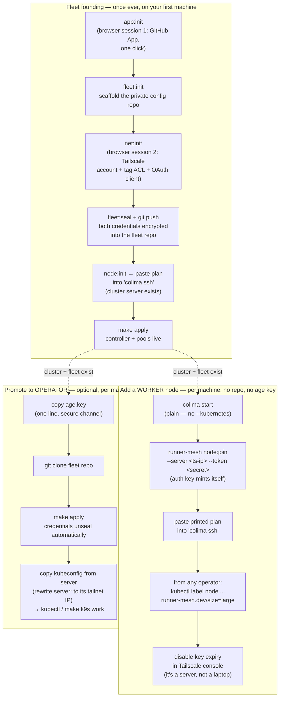

# Onboarding: from zero to a multi-machine fleet

Machines play one of two roles (or both): **workers** contribute capacity
to the cluster; **operators** manage the fleet (apply config, seal
secrets, use kubectl/k9s). The flows differ — a worker never needs the
fleet repo, the age key, or any GitHub credential.



## What travels between machines (the complete secret matrix)

| Secret | Who needs it | How it travels |
|---|---|---|
| **age key** (1 line) | Operators only | Hand-carried once (scp / password manager). The fleet's *secret zero* — everything else unseals from it. |
| **Cluster join token** | Workers, at join time | Included in the `node:join` command you run. Generated at `node:init`; keep it like a password. |
| Tailscale auth key | Nobody, manually | Minted automatically per join (`net:init` was the one-time setup). |
| GitHub App credentials | Nobody, manually | Sealed in the fleet repo; unseal is automatic for operators. Workers never need them. |
| kubeconfig | Operators wanting kubectl/k9s | Copied from the server once, `server:` field rewritten to the server's tailnet IP. |

Nothing above is ever committed in plaintext; the fleet repo carries only
SOPS-encrypted blobs plus non-secret declarations.

## Founding runbook (first machine, once ever)

```bash
git clone https://github.com/eilst/runner-mesh && cd runner-mesh
./bin/runner-mesh doctor                 # toolchain check
./bin/runner-mesh app:init               # browser session 1 (GitHub)
./bin/runner-mesh fleet:init ~/my-fleet  # scaffold the config repo
cd ~/my-fleet && $EDITOR repos.txt       # declare owner/repo, owner/repo@large, …
./bin/runner-mesh net:init               # browser session 2 (Tailscale)  [multi-machine fleets]
make seal && git init && git add -A && git commit -m init && git push  # to a PRIVATE repo
runner-mesh node:init                    # prints the server bootstrap plan
colima start && colima ssh               # run the plan inside the VM
make apply                               # controller + pools converge
```

Single-machine fleets can skip `net:init`/`node:init` entirely and use
`colima start --kubernetes` — see `docs/quickstart-colima.md`.

## Add a worker (each additional machine)

```bash
brew install colima
colima start --cpu 4 --memory 8          # plain — NOT --kubernetes (its bundled
                                         # k3s lacks --vpn-auth and cannot mesh)
runner-mesh node:join --server <server-tailnet-ip> --token <cluster-secret>
colima ssh                               # paste the printed plan
```

Then, from any operator machine:

```bash
kubectl get nodes                                        # new node Ready
kubectl label node <name> runner-mesh.dev/size=large     # size tier (if applicable)
```

Finally, in the Tailscale console: **Machines → the node → Disable key
expiry** (see `docs/tailscale-mesh.md` for why this matters during
control-plane outages). Pools need no changes — they're cluster-wide
state declared in the fleet repo; a new node only adds capacity, and any
`Pending` pods waiting for its labels schedule immediately.

## Promote a machine to operator

```bash
# 1. Receive the age key over a secure channel:
mkdir -p ~/.config/runner-mesh && $EDITOR ~/.config/runner-mesh/age.key && chmod 600 ~/.config/runner-mesh/age.key
# 2. Clone and converge — credentials unseal automatically:
git clone <your-fleet-repo> && cd <fleet> && make apply
# 3. (optional) kubectl/k9s access:
#    copy /etc/rancher/k3s/k3s.yaml from the server's VM, rewrite the
#    server: address to the server's tailnet IP, merge into ~/.kube/config
make k9s
```

## Docker Desktop machines

If a Mac's existing containers run on Docker Desktop rather than colima,
its VM can't host k3s (not ssh-able/provisionable). Create a colima VM
alongside (they coexist) and treat it as the cluster node; consider
migrating the machine's other container workloads into it eventually so
there's one VM per machine to size and monitor.
